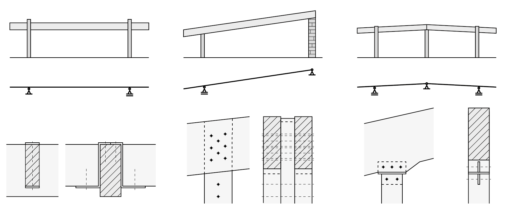
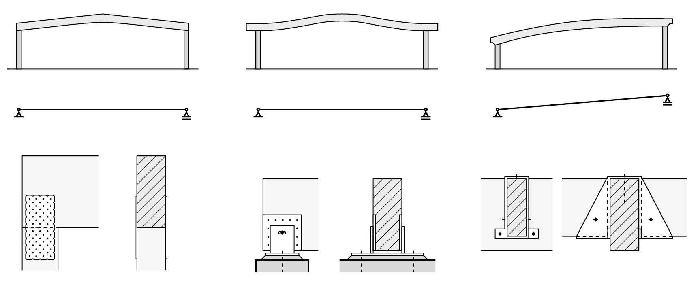
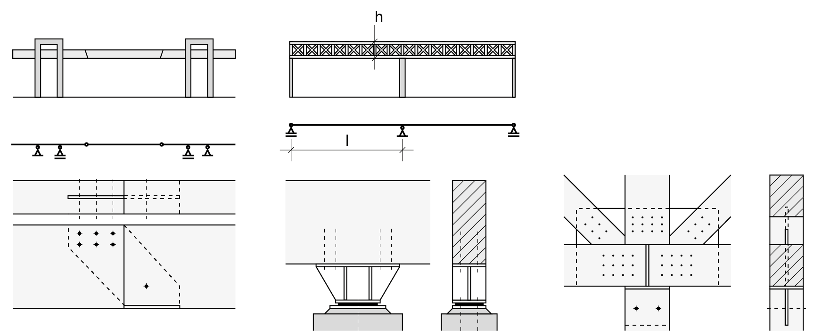
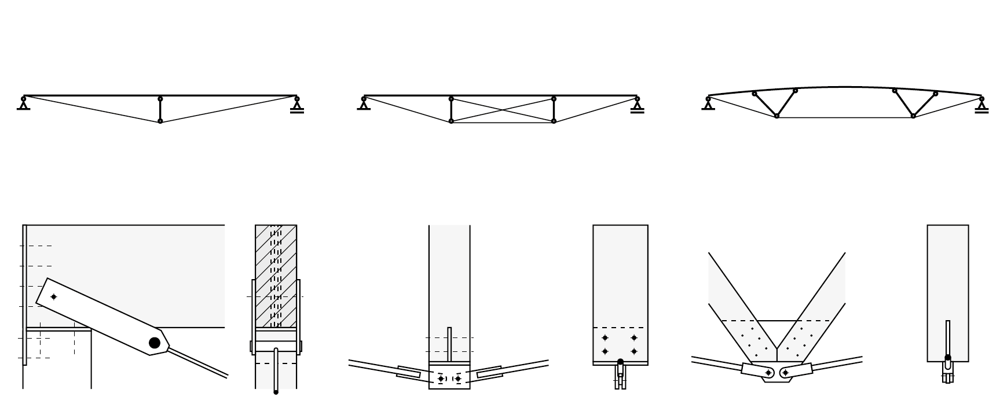
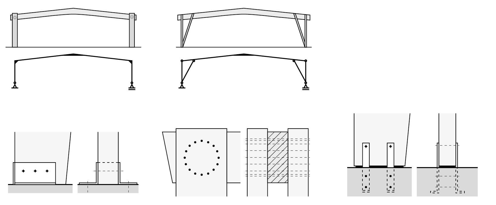
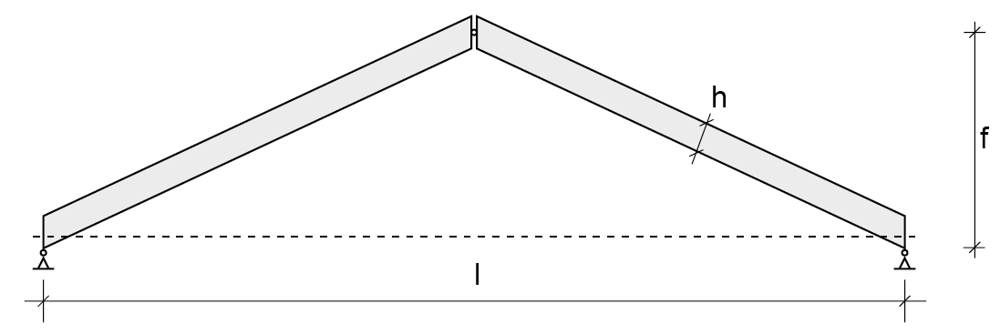
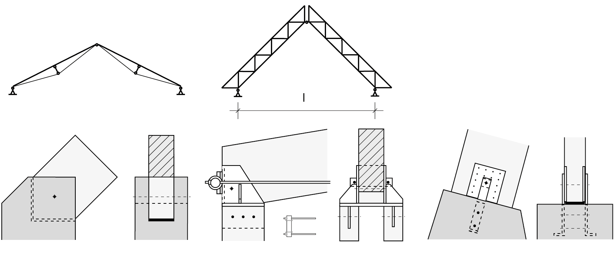
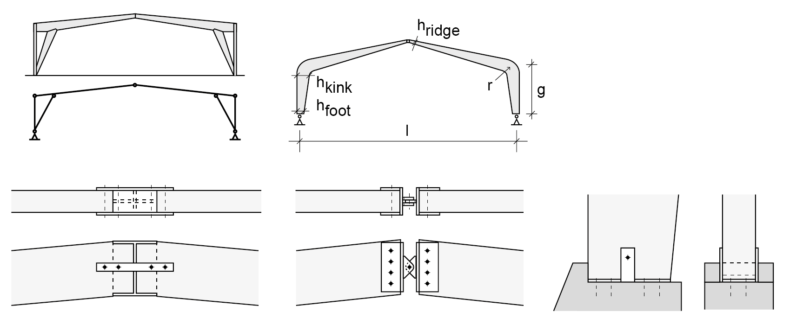
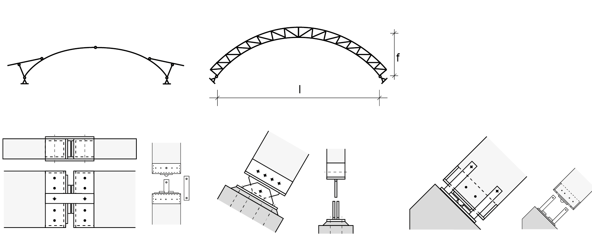

# Liggers

**Gelamineerde ligger**  
De ontwerpgrafiek geldt voor:

- Liggers van gelamineerd hout GL24h of meer.
- Een hart-op-hart afstand van 4 meter.
- Gevolgklasse CC2.
- Een lichte houten vloer G=2 kN/m².
- Liggerbreedte is ca. 1/3 van de liggerhoogte.


`````{admonition} Gelamineerde ligger
:class: tip


* Grijze lijn: q=5 kN/m² (bijeenkomstruimte)
* Oranje lijn: q=2,5 kN/m² (kantoorfunctie)
* Blauwe lijn: q=1,75 kN/m² (woonfunctie)

`````

## Houtconstructies met liggers


|   | rechte ligger (eventueel met toog) |  |  |
|---|---|---|---|
|   |  |  | **gezaagde balken** <br> l=2 tot 6m <br> h=l/15 à l/20 <br> <br> **gelamineerd hout** <br> l=6 à 30m <br> h.o.h<5m <br> h=l/17 <br> h.o.h=5-8m <br> h=l/16 |
| verschijningsvormen |  |  |  |
| details |  |  |  |
|  | oplegging op betonnen wand | oplegging op stalen kolom | oplegging van liggers op een dubbelen houten kolom (op een blok) |


<div style="max-height: 400px; overflow-y: auto;">
    <table style="width: 100%; border-collapse: collapse;">
        <thead style="position: sticky; top: 0; background-color: #f2f2f2;">
            <tr>
                <th></th>
                <th colspan="2">Rechte ligger (eventueel met toog)</th>
                <th></th>
            </tr>
        </thead>
        <tbody>
            <tr>
                <td></td>
                <td colspan="2"></td>
                <td><strong>gezaagde balken</strong><br>l=2 tot 6m<br>h=l/15 à l/20 <br> <strong>gelamineerd hout</strong><br>l=6 à 30m<br>h.o.h<5m<br>h=l/17<br>h.o.h=5-8m<br>h=l/16</td>
            </tr>
            <tr>
                <td>Verschijningsvormen</td>
                <td></td>
                <td></td>
                <td></td>
            </tr>
            <tr>
                <td>Details</td>
                <td></td>
                <td></td>
                <td></td>
            </tr>
            <tr>
                <td></td>
                <td>Oplegging op betonnen wand</td>
                <td>Oplegging op stalen kolom</td>
                <td>Oplegging op een dubbelen houten kolom (op een blok)</td>
            </tr>
        </tbody>
    </table>
</div>


<br>

**rechte ligger (eventueel met overstek)**
```{margin} 
**gelamineerd hout** <br> l=6 tot 30m <br> h.o.h.=3,6 à 5,4 <br> a=0,25 · l <br> h=l/16 à l/21 <br> h.o.h.=3 à 5m <br> <br> a=0,4 · l
```


  

oplegging gordingen op hoofdligger, Z stalen <span style="margin-left: 40px;"></span> dubbele ligger op een dubbele houten kolom, gebout <span style="margin-left: 40px;"></span> ligger op houten kolom, ingefreesde stalen plaat en oplegplaat, gebout

<br>

**zadeldak ligger met hellende bovenrand (gelamineerd)**
```{margin} 
**gelamineerd hout** <br> l=6 tot 30m <br> $h_1$=l/14 à l/18 <br> $h_2$=l/18 à l/22
```


  

ligger op wand, gelaste stalen oplegging <span style="margin-left: 40px;"></span> verbinding ligger-dubbele kolom, gebout <span style="margin-left: 40px;"></span> ligger-ligger verbinding doorgaande ligger, stalen schoen (gerberligger)

Toelichting: de bovenranden moeten zijdelings worden gesteund

<br>

**zadeldak ligger met hellende of gebogen boven- en onderrand (gelamineerd)**
```{margin} 
**gelamineerd hout** <br> l=7 tot 40m <br> h.o.h.=5 à 7m <br> h=l/14 à l/18
```


  

ligger-kolom verbinding, genagelde platen <span style="margin-left: 40px;"></span> oplegging op wand, zuiver scharnier, met slobgat, geschroefde stalen plaat <span style="margin-left: 40px;"></span> gording-hoofdligger verbinding middels stalen schoen. belasting afdracht bovenop hoofdligger

Toelichting: De bovenranden moeten zijdelings worden gesteund <br> **LET OP**: Door de gebogen vorm van de ligger ontstaan er trekspanningen loodrecht op de houtvezels: Kans op scheuren

<br>

**ligger op meerdere steupunten**
```{margin} 
**gelamineerd hout** <br> l=6 tot 30m <br> h.o.h.<5m <br> h=l/34 <br> h.o.h.=5 à 8m <br> h=l/30
```


```{margin} 
**vakwerkliggers gelamineerd hout** <br> l=10 tot 80m <br> h.o.h.=2 à 5m <br> h=l/16 à l/18
```
 

ligger-ligger verbinding, ingefreesde stalen plaat <span style="margin-left: 40px;"></span> oplegging voor zware lasten, gelast <span style="margin-left: 40px;"></span> verbinding in vakwerk (en kolom) m.b.v. koppelplaat, ingefreesd, stiften

Toelichting: De bovenranden moeten zijdelings worden gesteund

<br>

**rechte vakwerkligger**
```{margin} 
**gezaagd hout** <br> l=5 tot 25m <br> h.o.h.=2,5 à 6m <br> h=l/10 à l/14 <br> <br> **gelamineerd hout** <br> l=20 tot 80m <br> h.o.h.=2,5 à 6m <br> h=l/10 à l/15
```


 

verbinding trekstaven (stalen strip), onderrand en drukstaaf (koppelplaat) <span style="margin-left: 40px;"></span> verbinding onderrand en diagonalen, geschroevde stalen platen, stalen as <span style="margin-left: 40px;"></span> verbinding onderrand en diagonalen, geschroevde stalen platen, stalen

Toelichting: De (gedrukte) bovenranden moeten zijdelings worden gesteund bij alle vakwerken. Bij vakwerken van het type 1 moet ook de onderrand zijdelings worden gesteund omdat de trekband weg kan klappen.

<br>

**driehoekig- en trapeziumvormig vakwerk**
```{margin} 
**gelamineerd hout** <br> l=7,5 tot 30m <br> h.o.h.=3 à 7m <br> h=l/10 à l/15 <br> <br> **gezaagd hout** <br> l=5 tot 10m <br> h.o.h.<3m
```


Toelichting: De bovenranden moeten zijdelings worden gesteund

<br>

**onderspannen ligger**
```{margin} 
**gelamineerd hout** <br> l=8 tot 80m <br> h=l/15 à 1/20
```


 

details trekband bij de oplegging <span style="margin-left: 40px;"></span> aansluiting trekstaven en drukstaaf, ingefreesde gelaste platen <span style="margin-left: 40px;"></span> aansluiting trekstaven diagonalen, koppelplaat, stiften

Toelichting: De bovenranden moeten zijdelings worden gesteund. Ook moet de onderrand zijdelings worden gesteund, of in de bovenrand worden ingeklemd omdat de trekband anders weg kan klappen.

<br>

**portaalspant**
```{margin} 
**gelamineerd hout** <br> l=10 tot 40m <br> h.o.h.=4 à 8m <br> h=l/15 à l/23
```


 

kolom-vloer oplegging, hoekprofielen met opgelaste achterplaat, gebout <span style="margin-left: 40px;"></span> momentvaste verbinding ligger kolom, stiften <span style="margin-left: 40px;"></span> akolom-vloer oplegging, ingestorte beugels, gebout

Toelichting: Deze vloerverbinding is enkel geschikt voor kleine spatkrachten

<br>

**drie scharnieren spant (rechte ligger)**
```{margin} 
**gelamineerd hout, zonder trekband** <br> l=15 tot 50m <br> f=l/3 <br> h.o.h.=5 à 8m <br> h=l/30 à l/50 <br> <br> **gelamineerd hout, met trekband** <br> l=15 à 50m <br> f=l/6
```




eenvoudige vloeroplegging, betonnen voet met elastomeer <span style="margin-left: 40px;"></span> aansluiting dubbele trekband, oplegging op dubbele kolom <span style="margin-left: 40px;"></span> kolom-vloer oplegging op betonnen voet, ingestorte beugels, geschroefde plaat

Toelichting: Deze verbinding is enkel geschikt voor kleine spatkrachten

<br>

**drie scharnieren spant (gebogen/geknikt spantbeen)**
```{margin} 
**spant met geknikte hoeken** <br> l=15 tot 50m <br> $\alpha \approx 20^\circ$ <br> h.o.h.=4 à 5m <br> $\mathsf{h_{knik}} = (l+g)/28$ <br> $\mathsf{h_{voet}} = 0,4 \cdot \mathsf{h_{knik}}$
```


```{margin} 
**spant met gebogen hoeken** <br> l=15 tot 50m
```


nokverbinding met trek zekering, ingefreesd I-profiel <span style="margin-left: 40px;"></span> nokverbinding, gebout <span style="margin-left: 40px;"></span> oplegging kolom op betonnen voet, gelaste stalen plaat

Toelichting: Deze verbinding is enkel geschikt voor kleine spatkrachten

<br>

**boogspant (massieve en vakwerk ligger)**
```{margin} 
**gelamineerd hout** <br> l=20 tot 100m <br> f=l/5 à l/7 <br> h.o.h.<5m \hspace{0.2cm} h=l/45 <br> h.o.h.=5 tot 9m \hspace{0.01cm} h=l/40
```


```{margin} 
**vakwerk gelamineerd hout**
```


nokverbinding, stalen schoenen (met pin) <span style="margin-left: 40px;"></span> oplegging boogspant, gelaste stalen delen <span style="margin-left: 40px;"></span> oplegging boogspant

Toelichting: Deze verbinding is enkel geschikt voor kleine spatkrachten
