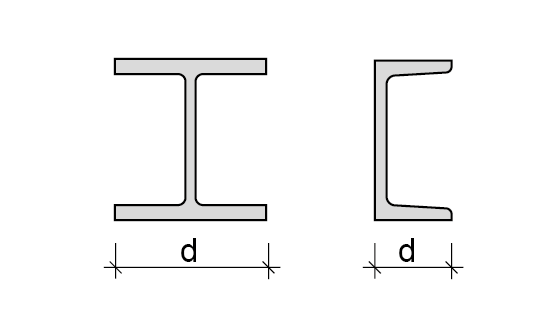

---
myst:
  substitutions:
    Standaard Profielen: |
      ```{image} Image/221_staalconstructies_standaard_profielen.png
      :alt: Standaard Profielen
      :scale: 50%
      ```
---

# Staal

## Schattingsregels staalconstructies

```{figure} Images/Jellema7Bouwmethodiek206.png
---
name: Jellema Staal
---
```


## Schattingsregels kolommen en wanden

**Kolommen**  
Schattingsregels voor kolommen zijn minder nauwkeurig dan voor vloeren en liggers. De belasting is namelijk in hoge mate afhankelijk van de hart-op-hart afstand van de kolommen en de hoeveelheid gedragen verdiepingen. Ook de kniklengte van de kolom is erg bepalend voor de vereiste doorsnede van de kolom.

De onderstaande schattingsregels voor stalen kolommen gelden voor:

- Kolommen van kokers, HEA profielen of zwaarder.
- Een kolommen grid van maximaal 8 bij 8 meter.
- De verdiepingshoogtes zoals in de tabel aangegeven.
- Een geschoorde constructie (dat betekent dat de standzekerheid van het gebouw wordt gewaarborgd door de wanden of windverbanden en niet door momentvaste verbindingen).


> **Staalkolom**  
> 
> | Aantal verdiepingen | Verdiepingshoogte | Kolom afmeting * [mm] |
> | --- | --- | --- |
> | v = 1 | L ≤ 8m | L / 25 |
> | 1 < v ≤ 3 | L ≤ 4m | L / 20 |
> | 3 < v ≤ 5 | L ≤ 4m | L / 16 |
> | 5 < v ≤ 8 | L ≤ 4m | L / 13 |
> | 8 < v ≤ 12 | L ≤ 4m | L / 11 |
> 
> * De kolomafmeting die gevonden wordt geldt voor de richting waarin de kolom zal uitknikken. Dit is gewoonlijk de zwakke richting, tenzij knikverkorters zijn toegepast.  
> * v is het aantal verdiepingen dat door de kolom gedragen wordt.  
> * L is de lengte van de kolom (gelijk aan verdiepingshoogte).


**Wanden**  
Wanden van staal zijn meestal geconstrueerd als een serie stalen kolommen met stijl en regelwerk ertussen en een lichte bekleding. De afmeting van de wand kan dus met de schattingsregels voor kolommen worden bepaald. Ook hier geldt dat andere dan de constructieve eisen maatgevend kunnen zijn. Denk hierbij aan brandvertraging en akoestische en thermische isolatie.

**Stabiliteitsvlakken (windverbanden)**  
Staalconstructies worden meestal standzeker gemaakt door middel van een geschoord raamwerk, ook wel windverband genoemd.

> **Stabiliteitswand**  
> Een windverband in een staalconstructie heeft een lengte (horizontale afstand tussen de stijlen) van de gebouwhoogte gedeeld door 6.  


## Staalconstructies


|  | **Stalen kolommen**  |  |
|---|---|---|
| Standaard profielen |  | één bouwlaag: <br> $ h_{bouwlaag} = 2 \; \ \grave{a} \; 8 \, \text{m} $ <br> $ d = \frac{h_{bl}}{20} \; \grave{a} \; \frac{h_{bl}}{25} $ <br> Meerdere bouwlagen: $ h_{bl} = 2 \; \grave{a} \; 4 \, \text{m} $ <br> $ d = \frac{h_{bl}}{7} \; \grave{a} \; \frac{h_{bl}}{18} $ |


